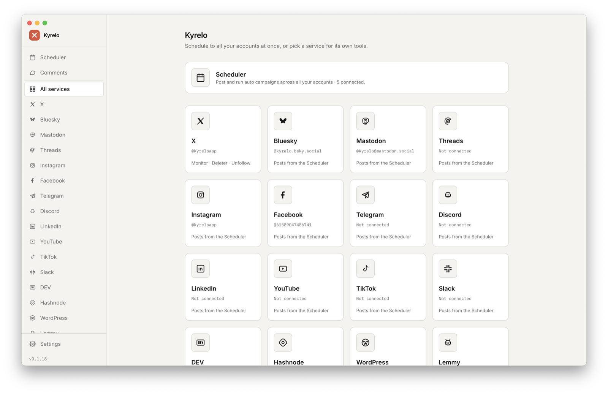
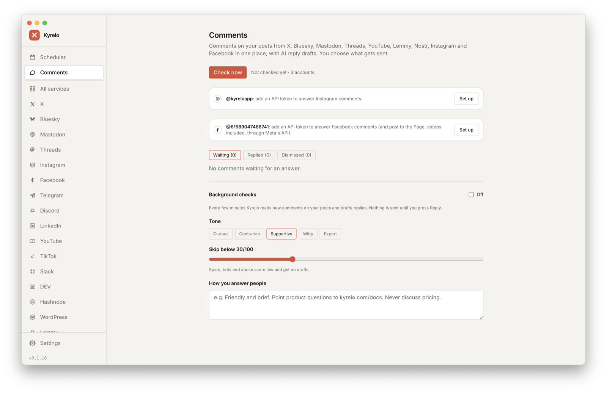
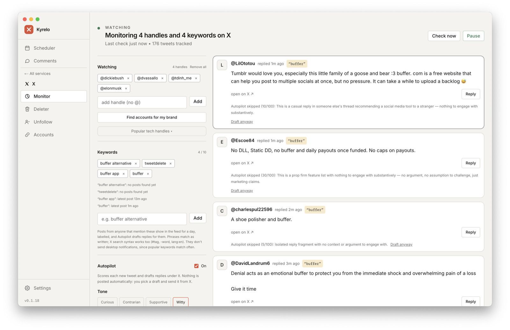
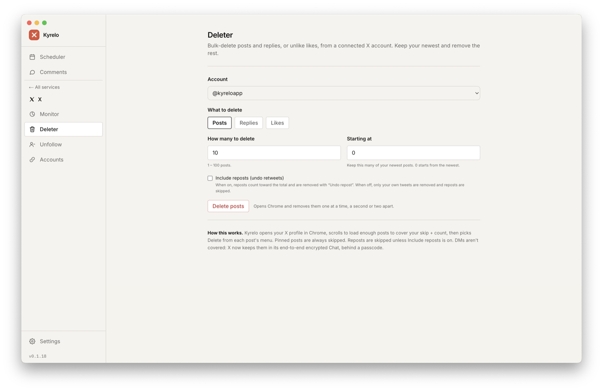

# Kyrelo — Community Driven Buffer Alternative

A local desktop app, iPhone companion and marketing site for **Kyrelo**, the open-source, community-driven alternative to Buffer and Postiz. It runs on your own computer, posts to 17 platforms, and answers your comments with AI drafts you approve.

- **Publish:** schedule posts, images and videos to X, Bluesky, Mastodon, Threads, Instagram, Facebook, LinkedIn, YouTube, TikTok, Telegram, Discord, Slack, DEV, Hashnode, WordPress, Lemmy and Nostr. Give each account its own version of a post (the AI can adapt it to each platform), plan on a calendar, keep your images and videos in Media buckets for posts and campaigns, auto-post new articles from RSS feeds, or let an AI auto campaign research, write and space out a whole series. Sent posts show their likes, reposts, replies and views where the platform shares them.
- **Answer comments:** one inbox for the comments people leave on your posts on X, Bluesky, Mastodon, Threads, YouTube, Instagram, Facebook Pages, Lemmy and Nostr. The AI drafts replies in your voice and skips spam; nothing is sent until you press Reply.
- **Engage:** watch X handles and keywords in the Monitor; Autopilot drafts replies under new posts for you to pick, edit and send yourself.
- **iPhone companion:** shoot a photo or video and send it straight into a Media bucket on your computer, answer comments, check the Monitor, schedule posts and run campaigns from your phone.
- **Clean up:** bulk delete posts, replies and reposts, unlike likes, and unfollow dead, bot-like or never-engaging accounts with a reason for each.

**Website:** [kyrelo.com](https://kyrelo.com/)
**Download the app here:** [GitHub Releases](https://github.com/sobytes/Kyrelo/releases/)



| Comments | Monitor & Autopilot | Deleter |
|---|---|---|
|  |  |  |

## Why?


Buffer's status page is a working-day fixture. Multi-hour outages, ~97% uptime over the last quarter. When the scheduling layer is someone else's cloud, it breaks at exactly the moments you need it up.

Kyrelo runs entirely on your machine. No backend, no SaaS account, no shared infrastructure.

## Repo layout

| Folder | What it is |
|---|---|
| [`desktop/`](./desktop) | The Electron + Next.js + Playwright app, with a Scheduler and auto campaigns across every platform, and each service's own tools (X: Monitor + Autopilot, Deleter, Unfollow). Built for macOS first. |
| [`mobile/ios/`](./mobile/ios) | Native iPhone app (SwiftUI), paired with the desktop app, which does the work: Media (photos and videos from the phone into your buckets), Comments, the Monitor feed and reply drafts, the Scheduler, and auto campaigns. Xcode project generated from `project.yml` by XcodeGen and committed. |
| [`contracts/`](./contracts) | Rules the desktop and iOS apps must agree on, as test fixtures both apps' tests read. |
| [`website/`](./website) | The marketing site at [kyrelo.com](https://kyrelo.com). Plain Next.js + Tailwind, deploys to Vercel with **Root Directory = `website`**. |

## Running it

You need **Node.js 20+**, **npm** and **Google Chrome**. X, Instagram and Facebook connect by logging in through Chrome, which Kyrelo drives to post. Every other platform uses its official API.

```bash
git clone https://github.com/sobytes/Kyrelo.git
cd Kyrelo
./build.sh desktop run
```

The first run installs dependencies and downloads Playwright's Chromium, so give it a minute. The app window opens on its own.

The app opens on a home screen: the **Scheduler**, which posts to all your accounts, **Comments**, and the services, each with its own tools. Settings are shared by all of them. In the app:

1. **A service → Accounts** → connect it. Each screen walks you through it:

   | How it connects | Platforms |
   |---|---|
   | Log in through a normal Chrome window | X, Instagram, Facebook |
   | Your server's name; approve Kyrelo in the browser | Mastodon |
   | An app password, token or key you paste | Bluesky, Threads, LinkedIn, Telegram (your bot), Discord and Slack (a channel webhook), DEV, Hashnode, WordPress (an application password), Lemmy, Nostr |
   | Your own developer app's client ID and secret, then approve it in the browser | YouTube (Google Cloud), TikTok |

   Where a platform needs a developer app (Threads, LinkedIn, YouTube, TikTok, and Instagram or Facebook comments), you make your own, so its limits and approvals are yours: YouTube keeps uploads private until Google audits your project, and TikTok videos land in your TikTok inbox to finish there. Reddit and Pinterest now approve every new API app by hand, so they're not supported yet.
2. **Settings → API keys** → add a Claude or OpenAI key for AI replies, rewrites and auto campaigns. The page has step-by-step instructions for getting one.
3. **Scheduler** → write and schedule posts to any of your accounts at once, with an image or a video (X, Bluesky, Mastodon, Telegram, Discord, YouTube, TikTok, and Facebook Pages with a token), and switch to the **Calendar** to see everything planned. Tick **Different text for each account** to tailor each version, with **Adapt** to have the AI suit it to the platform. **Auto-post from a feed** turns new articles in an RSS or Atom feed into posts. **Auto-generate campaign** plans a whole series and posts it to every account you pick, written to fit the strictest platform's limit.
4. **Media** → keep your images and videos in named buckets (an item can be in several). The AI looks at each image, and a frame of each video, and describes it. **Trim** cuts a clip from a video (play it and tap Start here / End here, or one tap for "the first 2:20 for X"). You don't have to think about limits: when a post goes out, each platform gets a version of the video that fits its length and size limits. Attach any of them to a post with **From library** in the Scheduler, or give an auto campaign a bucket, and the AI picks the item that best fits each post.
5. **Comments** → turn on background checks; new comments on your posts arrive with reply drafts. Pick one, edit it, and reply. Instagram and Facebook comments need a token from your own Meta app (the page walks you through it); with one, a Facebook Page also posts through Meta's API instead of the browser.

The Scheduler, Comments and campaigns cover every platform they can; a service's own tools are set in [`contracts/services.json`](./contracts/services.json): X has Monitor, Deleter, Unfollow and Accounts, the others Accounts for now.

Your data (keys, tokens, browser sessions, scheduled posts, uploads) stays on your machine in the app's data folder and is never committed.

### build.sh

Everything goes through `build.sh` at the repo root. Run it with no arguments for the full list.

| Command | What it does |
|---|---|
| `./build.sh desktop run` | Launch the desktop app in dev mode |
| `./build.sh website run` | Website on http://localhost:3000 |
| `./build.sh desktop` | Production build of the desktop app |
| `./build.sh website` | Production build of the website |
| `./build.sh ios` / `./build.sh ios run` | Build the iPhone app / run it in the simulator |
| `./build.sh check` | Type-check both apps, run the desktop and iOS tests, scan for committed secrets |
| `./build.sh desktop pack` | Unsigned `.app` / `.exe` in `desktop/dist/` to try locally |
| `./build.sh desktop release test` | Dry run of the release build (no notarising, push or upload) |
| `./build.sh desktop release` | Maintainers only: publish a signed release (below) |

On Windows, run `build.sh` from Git Bash.

### iPhone app

The iPhone app isn't on the App Store yet: you build it onto your phone with Xcode (free; you need a Mac and an Apple ID).

1. Open `mobile/ios/Kyrelo.xcodeproj` in Xcode.
2. Select the **Kyrelo** target → **Signing & Capabilities**, choose your own team (your Apple ID works), and change the bundle identifier if Xcode asks for a unique one.
3. Plug in your iPhone (or pick it over Wi-Fi), select it as the destination and press **Run**. The first time, trust the developer on the phone in **Settings → General → VPN & Device Management**.

Then turn on **Settings → Phone app** in the desktop app and scan the code in the iPhone app. The phone shows your Monitor feed and Autopilot's drafts; tap a draft, and it copies the reply and opens the tweet in X for you to send. **Comments** shows the comments waiting for an answer, with their drafts, and replies from your computer when you tap Reply. **Media** is where the phone shines: take a photo or video (or pick one from your library) and send it straight into a bucket on your computer, ready for posts and auto campaigns. Videos are converted to 1080p MP4 on the phone first. New posts can use anything in your media too. You can also schedule posts (with photos) and run auto campaigns. Your computer keeps doing the work, so Kyrelo has to be running there. It works on the same Wi-Fi, or anywhere with [Tailscale](https://tailscale.com) on both devices.

> [!WARNING]
> On plain Wi-Fi the phone connection isn't encrypted. On a shared or public network, use Tailscale or turn phone access off. See [Known issues](#known-issues).

### Releasing (maintainers)

`./build.sh desktop release` runs `check` first and only starts from a clean `main`.

- **macOS** bumps the patch version, commits and tags it, builds, signs and notarises, pushes, and creates the GitHub release with the `.dmg`. Needs `APPLE_ID`, `APPLE_APP_SPECIFIC_PASSWORD` and `APPLE_TEAM_ID` in `desktop/.env.local`, a Developer ID certificate in the keychain, and `gh auth login`.
- **Windows**, run afterwards on a Windows machine, builds and signs the installer and attaches it to the same release. Needs `WINDOWS_CERT_THUMBPRINT` in `desktop/.env.local` and `gh auth login`.

See `desktop/.env.example` for every variable.

### Website

Plain Next.js + Tailwind. Vercel deploys it from `main` with **Root Directory = `website`**. See [`website/README.md`](./website/README.md).

## Known issues

### Phone connection isn't encrypted on plain Wi-Fi

> [!CAUTION]
> Pairing stops strangers from connecting to your computer, but the connection itself is plain HTTP. The phone sends its pairing token with every request, so anyone on the same network watching the traffic can copy it and pretend to be your phone.

With the token, someone could do what the phone app can: post and schedule as you, reply to comments, add to or remove from your Media library, run the tweet deleter or unfollow tool on your X account, and use your AI credits. They can't see your API keys or account logins, remove accounts, change phone access, or reach anything else on your computer.

Until the connection is encrypted:

- **Home Wi-Fi you trust:** fine.
- **Shared or public Wi-Fi** (cafés, offices, hotels): install [Tailscale](https://tailscale.com) on both devices (it encrypts everything), or turn off **Settings → Phone app** on the desktop.
- **If you think the token leaked:** reset pairing in **Settings → Phone app** and scan the new code. Old tokens stop working right away.

Phone access is off until you turn it on, so if you don't use the iPhone app this doesn't affect you.

## Third-party software

The desktop app bundles [FFmpeg](https://ffmpeg.org) (static builds from the [ffmpeg-static](https://github.com/eugeneware/ffmpeg-static) project) to fit videos to each platform and cut clips. FFmpeg is free software under the GPL; it runs as a separate program, and its licence and where to get its source ship next to it in the app (`Resources/ffmpeg/LICENSE` and `README`). `npm run ffmpeg:install` (in `desktop/`) downloads it for development.

## Disclaimer

Kyrelo is an independent, open-source experiment, provided as is under the [MIT license](./LICENSE). It isn't affiliated with, endorsed by or sponsored by X Corp., Bluesky, Meta, Google, TikTok, LinkedIn, Buffer, Postiz, TweetDelete, Anthropic, OpenAI or any other platform it works with; their names are used only to describe what Kyrelo works with or compares to, and remain their owners' trademarks.

You're responsible for how you use it, including following each platform's terms and automation rules. Kyrelo drives your own logged-in browser to post, delete, follow and read X (and to post to Instagram and Facebook), which those platforms' terms restrict, and they may limit or suspend accounts they think are automated. Kyrelo never sends a reply without you pressing Reply, and paces bulk actions, but use it at your own risk.

